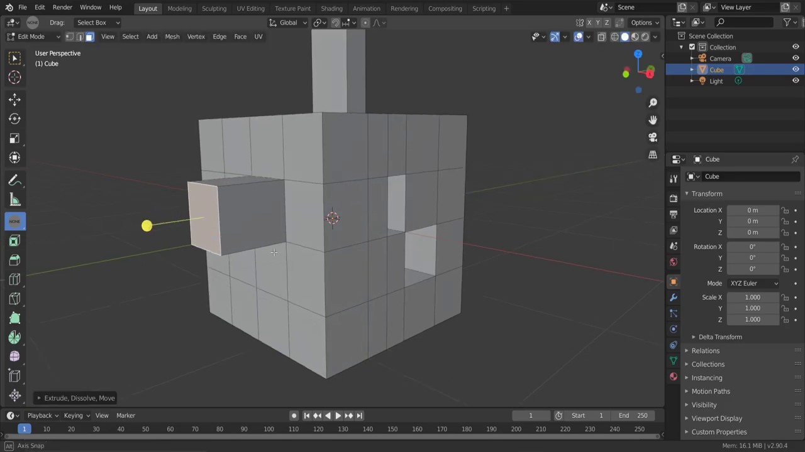

<DOCTYPE html>
<html lang="fr">
<head>
    <link rel="stylesheet" type="text/css" href="stylesheet.css">
    <title>{{ page.title }}</title>
</head>
<body>
    

        <a href="#navbar">Home</a>
        <a href="#krita">Krita</a>
        <a href="#blender">Blender</a>
        <a href="#inkscape">Inscape</a>
        <a href="#scribus">Scribus</a>
        <a href="#kdenlive">Kdenlive</a>
        <a href="#godot">Godot</a>
        <a href="#audacity">Audacity</a>
    

    

        <h1>Krita</h1>
        <h2> {{ page.krita-use }}</h2>
        
        
 {{ page.krita-description }}

        <a href="blank">en apprendre plus</a>
        
Voir aussi : <a href="blank">GIMP</a>.

        
Voir aussi 2 : {{ page.krita-link }}

    

    

        <h1>Blender</h1>
        <h2>Modélisation 3D, animation 2D & 3D, montage vidéo et bien plus.</h2>
        
        
Class aptent taciti sociosqu ad litora torquent per conubia nostra, per inceptos himenaeos. Vestibulum ante ipsum primis in faucibus orci luctus et ultrices posuere cubilia curae; Sed egestas viverra lectus, nec finibus felis tincidunt eget. Sed id augue tellus. 

        <a href="blank">en apprendre plus</a>

    

    

        <h1>Inkscape</h1>
        <h2>Dessin vectoriel et illustration.</h2>
        
        
Vestibulum venenatis urna et dignissim luctus. Morbi bibendum lorem ac eros ullamcorper iaculis. Nullam ut aliquam ipsum. Aliquam pellentesque sapien id leo imperdiet lacinia. Nam porta sapien neque, ac tempus sapien facilisis at.

        <a href="blank">en apprendre plus</a>

    

    

        <h1>Scribus</h1>
        <h2>Mise en page.</h2>
        
        
Donec et rutrum risus. Fusce tellus tortor, rutrum ut mattis ut, egestas non sapien. In imperdiet, ipsum et varius volutpat, est risus dictum dolor, a ornare erat velit quis mi. Curabitur lorem lectus, fringilla ut velit eget, condimentum condimentum neque. Aenean condimentum auctor odio, nec imperdiet orci cursus eget.

        <a href="blank">en apprendre plus</a>

    

    

        <h1>Kdenlive</h1>
        <h2>Montage vidéo.</h2>
        
        
Phasellus id ex venenatis, tempus ipsum vitae, fermentum purus. Praesent finibus diam pellentesque urna vulputate pharetra. 

        <a href="blank">en apprendre plus</a>
        
Voir aussi : <a href="blank">Blender (VSE)</a>, <a href="blank">OpenShot</a>
    

    

        <h1>Godot</h1>
        <h2>Moteur de jeux 2D & 3D.</h2>
        
        
Donec eget pretium nisl. Phasellus magna est, blandit feugiat elit vel, accumsan congue neque. Mauris dictum eget eros id bibendum. Sed sollicitudin nulla purus, a dictum libero consectetur in. Praesent et sollicitudin ante, interdum sollicitudin purus.

        <a href="blank">en apprendre plus</a>
        
Voir aussi : <a href="blank">LÖVE (2D)</a>
    

    

        <h1>Audacity</h1>
        <h2>Enregistrement et édition audio.</h2>
        
        
Vestibulum sed imperdiet urna. Maecenas sit amet magna quam. Suspendisse fermentum tempor urna, ac lacinia lorem auctor vitae. Aenean blandit nunc in diam finibus tincidunt. Fusce id dui urna. Praesent tempus elementum eros ac tincidunt. 

        <a href="blank">en apprendre plus</a>

    

</body>
