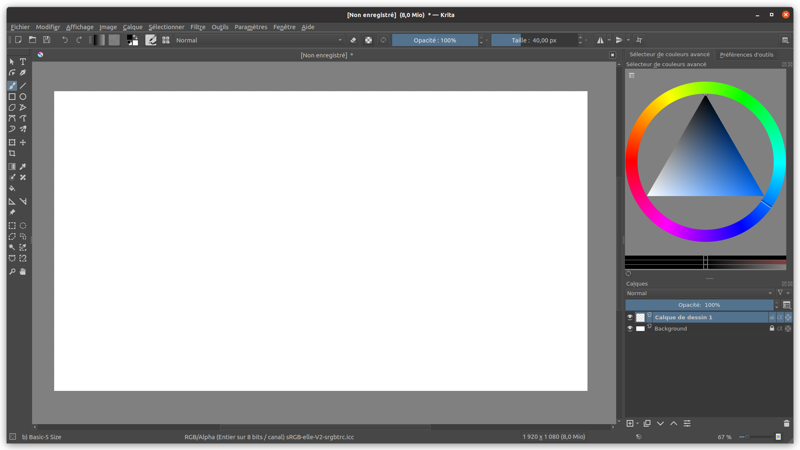

Répertoire de logiciels libres qui permettent de commencer son atelier de création numérique.

## [Krita](https://krita.org/fr)
Dessin et peinture numérique, retouche d'image simple, animation 2D

*Alternatif Photoshop*

[en savoir plus]()

 

## [Blender](https://www.blender.org/)
Modélisation 3D, animation 2D & 3D, montage vidéo et bien plus

*Alternatif Maya, Cinema4D*

 

## [Inkscape](https://inkscape.org/fr/)
Dessin vectoriel et illustration

*Alternatif Illustrator*

 

## [Scribus](https://www.scribus.net/)
Mise en page de documents

*Alternatif InDesign*

 

## [Kdenlive](https://kdenlive.org/fr/)
Montage vidéo

*Alternatif Premiere*

 

## [Godot](https://godotengine.org/)
Moteur de jeu 2D & 3D

*Alternatif Unity, GameMaker*

 

## [Audacity](https://www.audacityteam.org/)
Enregistrement et édition audio

---

## Autres logiciels

### [GIMP](https://www.gimp.org/)
Retouche et manipulation d'image

*Alternatif Photoshop*

## [OBS Studio](https://obsproject.com/)
Enregistrement ou livestream d'écran & webcam

### [Synfig](https://www.synfig.org/)
Animation 2D

### [FontForge](https://fontforge.org/)
Création de police de caractères
